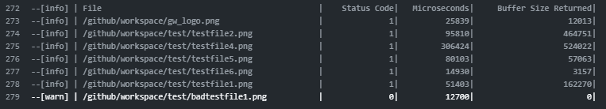

<div align="center" style="text-align:center">
  
# Glasswall Rebuild GitHub Action
## Trust Every File

We are a file regeneration and analytics company, and a leader in the field of CDR: Content Disarm and Reconstruction.


</div>

## Motivation
Open-source software is ever expanding and contributers can have malicious intentions. Glasswall Rebuild allows integration into your repository, scan through images, documents and other filetypes to inform repository owners of potentially malicious files.

## Arguments

Glasswall Rebuild GitHub Action currently supports one input from the user: `filetype` See [Glasswall Rebuild Supported Filetypes](https://docs.glasswallsolutions.com/sdk/rebuild/Content/Product-Description/File%20Types%20Supported.htm?Highlight=supported)

| Input  | Description | Usage |
| :---:     |     :---:   |    :---:   |
| `filetype`  | Extension of the files to scan in the repository  | Required |

### Example `workflow.yml` with Glasswall Rebuild Github Action
```yaml
name: Example workflow for Glasswall Rebuild
on: [push]

jobs:
  CI_Pipeline:
    runs-on: ubuntu-latest
    name: Pipeline Using Glasswall Rebuild
    steps:
      # To use this repository's private action,
      # you must check out the repository
      - name: Checkout
        uses: actions/checkout@v2

      - name: Glasswall Rebuild
        uses: tpilvelis-gw/rebuild-action@v1
        with:
          filetype: 'png'
```

## Output

Upon use of the Glasswall Rebuild Github Action within the logs you will see a report displaying all the files with the relevant filetype and their Glasswall Rebuild processing result.


Please refer to [Glasswall Documentation](https://docs.glasswallsolutions.com/sdk/rebuild/) in order to understand the status codes returned.
